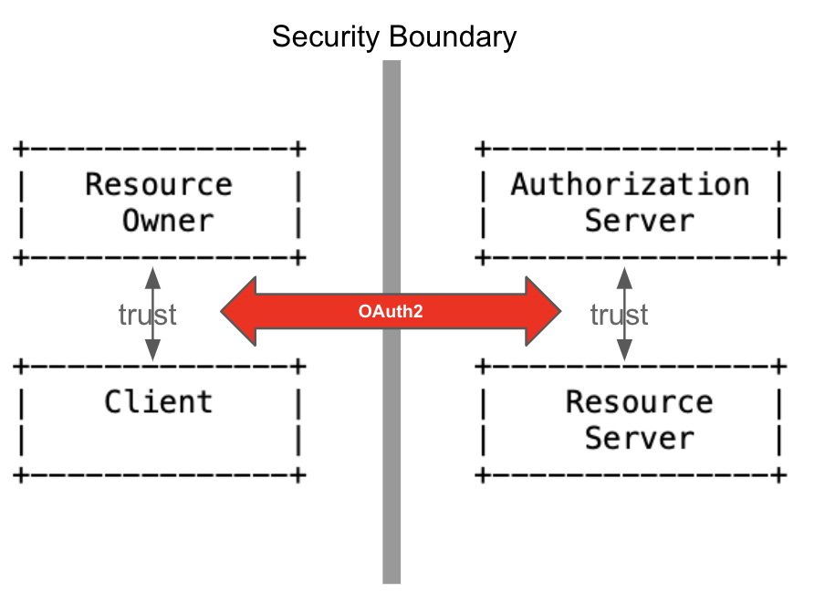

## 1. Basics

#### 1. OAuth2 프로토콜 구성 요소
다음은 OAuth2 보안 도메인의 구성요소(Component)들에 대한 설명이다. 자원소유자를 제외하고 대부분의 구성요소는 OAuth2 상세에 맞게 소프트웨어로 구현되어야 한다.  

1. 보호자원(Protected Resource)
	

	웹서비스의 서비스 데이터들이다. 사진 서비스에서는 사용자들이 올린 사진, 블로그나 게시물 서비스에서는 사용자들의 포스트들이다.
        보통, API라 부르는 URL(엔드포인트, Endpoint)을 통해 자원에 접근(Access)하게 되는데 접근을 위해서는 적절한 권한이 있어야 한다. 자원은 적절한 권한이 없는 접근에 대해 보호되어야 한다.  
	

2. 자원소유자(Resource Owner)
	

	보호자원의 소유자를 가리킨다. 일반적으로 웹서비스의 사용자다. 보호자원에 접근하는 주체(애플리케이션)는 자원소유자로 부터 접근권한을 인가 받아야 한다.
	

3. 자원서버(Resource Server) 
	

	자원을 제공(서비스)하는 서버다. 보통, API를 제공하는 웹서비스라 생각하면 된다. 자원서버는 API를 통한 자원에 대한 접근에 적절한 권한이 있는 지 확인하고 서비스해야 한다.
	

4. 클라이언트(Client) 
	

	보호자원에 접근하는 애플리케이션이다. 자원서버의 API를 직접 호출하기 때문에 자원서버의 클라이언트가 된다.
        클라이언트는 보호자원에 접근하기 전에 그 자원의 소유자(사용자)에게 자원에 대한 권한(Authority)을 먼저 인가(Authorization) 받아야 한다. 
	API를 통해 접근하는 클라이언트는 자원서버에게 권한 인가의 증거를 제출해야 하며 자원서버는 그 증거가 유효한지 반드시 확인해야 한다.
	

5. 인가 서버(Authorization Server)
	

	자원소유자는 클라이언트에게 자신의 자원에 대한 권한을 먼저 인가(Authorization)한다. 이 과정을 통해 자원소유자와 클라이언트 사이에는 신뢰관계가 만들어진다. 하지만 둘만의 신뢰관계일 뿐, 자원에 대한 권한인가를 주장하는 클라이언트의 주장을 자원서버는 믿어 줄 수 없다.  
	

	

	현실에서 이 상황을 비유해보면, 클라이언트의 권한인가 주장은 공적인 법적 권위로 증명받아야 한다. 그리고 클라이언트는 그 증명을 들고 다니면서 자원에 대한 권한 행사를 해야 한다. 이를 공증이라 부른다. 
	

	

	OAuth2도 앞의 비유와 비슷하다. 법적 권위가 바로 인가서버다. 사실, 인가 승인(Grant) 서버가 더 정확한 용어 같다. 자원소유자의 권한을 클라이언트에게 인가한 것을 승인하기 때문이다. 그리고 그 승인의 증명이 되는 공증서류는 액세스 토큰이다.
        현실에서 공증서류는 법적으로 강력한 증거력을 갖고 있다. 마찬가지다. 클라이언트가 자원서버에게 제출하는 액세스 토큰은 자원에 접근할 수 있는 강력한 증거다. 당연히 자원서버는 인가서버에게 액세스 토큰의 유효성을 검증받아야 한다.  
	

#### 2. OAuth2 Abstract Flow
앞에서 설명한 OAuth2의 구성 요소들 사이의 관계들을 도식화하면 다음과 같다. 이 플로우는 OAuth2 프로토콜의 실제 구현 플로우라기 보다는 구성 요소들의 역할과 상호작용, 그리고 핵심 개념을 쉽게 설명하기 위한 추상적 플로우이다.

<pre>
+--------+                               +---------------+
|        |--(A)- Authorization Request -&gt;|   Resource    |
|        |                               |     Owner     |
|        |&lt;-(B)-- Authorization Grant ---|               |
|        |                               +---------------+
|        |
|        |                               +---------------+
|        |--(C)-- Authorization Grant --&gt;| Authorization |
| Client |                               |     Server    |
|        |&lt;-(D)----- Access Token -------|               |
|        |                               +---------------+
|        |
|        |                               +---------------+
|        |--(E)----- Access Token ------&gt;|    Resource   |
|        |                               |     Server    |
|        |&lt;-(F)--- Protected Resource ---|               |
+--------+                               +---------------+
</pre>

1. (A), (B)
	

	클라이언트는 자원서버로의 자원 요청(E)을 위해 먼저 자원소유자에게 자원에 대한 권한인가(Authorization)를 요청한다. 자원소유자는 클라이언트에게 자원에 대한 권한인가를 승인(Grant)한다. 
	

2. (C) , (D)	
	

	클라이언트는 인가서버에게 자원 소유자에게 받은 권한인가 승인에 대한 액세스 토큰 발급을 요청한다. 인가 버는 인가승인을 액세스 토큰으로 발급한다. (인가승인에 대한 공신력 있는 제3자 공증 행위)
	

3. (E), (F) 	
	

	클라이언트는 자원서버에게  발급 받은 토큰과 함께 보호된 자원을 요청한다.  자원서버는 토큰을 발급한 인가서버를 통해 토큰의 유효성을 확인(Introspection)하고 보호된 자원을 클라이언트에게 제공(서비스) 한다. 
	

#### 3. OAuth2 Features
1. Authorization
	

	OAuth2는 권한에 대한 인가(Authorization)에만 관심을 가진다. 그리고 자원소유자가 클라이언트에게 승인한 권한인가를 완벽히 보증하고 자원을 안전히 보호하는 프로토콜이다.
	

	
2.  Delegated Authorization
	

	OAuth2는 자원소유자의 자원 접근 권한을 클라이언트에게 위임(Delegate)하는 프로토콜이다. OAuth2는 이 위임 과정을 여러 인가 승인 타입(Authorization Grant Type)으로 상세한다. OAuth2 구현은 바로 이 인가 승인에 참여하고 있는 구성 요소와 그 과정을 구현하는 것이다.   
	

	

	한편, 자원서버의 승인된 인가에 대한 확인 작업도 인가서버에게 위임된다.  따라서 OAuth2는 자원소유자/클라이언트 그리고 자원서버/인가서버 간에 신뢰관계를 기본 전제로 한다. 그리고 이 둘 관계 사이에 있는 복잡한 보안 문제를 OAuth2는 비교적 단순한 방식으로 해결한다.  
	

	

	
3. Access Token
	

	OAuth2의 인가 승인 플로우에서 인가 승인의 물리적 증거는 액세스 토큰(Access Token)이다. 자원소유자의 클라이언트에 대한 자원 접근 인가에 대한 승인을 액세스 토큰 발급으로 보증한다. 인가서버가 둘 사이에서 인가 과정를 중개하고 최종적으로 승인한다. 
	

	

	한편, 자원서버는 클라이언트가 자원 접근을 할 때 제출한 토큰으로 인가서버로 부터 승인된, 자원소유자가 인가한 접근인지 판단해야 한다. OAuth2의 인가 승인 플로우를 보면, 토큰을 발급한 인가서버만이 이를 확인해 줄 수 밖에 없다.
	

#### 3. Authorization Grant Type 
"OAuth2의 핵심은 자원소유자의 자원에 대한 권한 <strong>인가 승인(Authorization Grant)</strong>, 이를 보증하는 <strong>액세스 토큰(Access Token)</strong> 그리고 액세스 토큰으로 자원 접근이다." 

OAuth2는 실제 구현(Practical Implementation)을 위한 인가 승인 타입(Authorization Grant Type)이라는 모델을 네 가지정도로 상세하고 있다. 대부분의 표준 상세가 그렇지만, OAuth2도 모델만을 제시할 뿐 구체적인 기술들에 대한 상세는 따로 없다. 따라서 구현에서도 플랫폼, 개발언어, 통신 방식도 자유롭다. 하지만 실제적으로는 OAuth2 구성 요소들 사이의 HTTP 통신으로 구현되며 구성 요소들은 소프트웨어 또는 구현 코드가 된다. 예제는 다음과 같은 기술들로 구성 요소와  Authorization Grant Flow를 구현한다.

1. Authorization Server: JBoss Keycloak Solution
1. Resource Server: Spring Web + Spring Security OAuth
2. Client: Spring Security OAuth + React JWT Handling 
3. Access Token: JWT

OAuth2 에서 상세하고 있는 Authorization Grant Type은 다음의 네 가지 이다.
1. Authorization Code Grant
2. Implicit Grant
3. Resource Owner Password Credentials Grant
4. Client Credentials Grant

OAuth2 Specfication 은 [여기](https://datatracker.ietf.org/doc/html/rfc6749)서 참고 한다.
