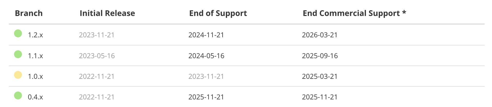
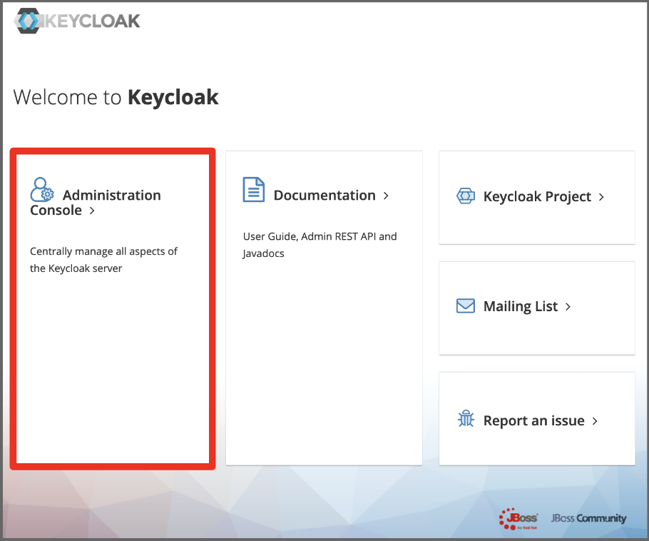
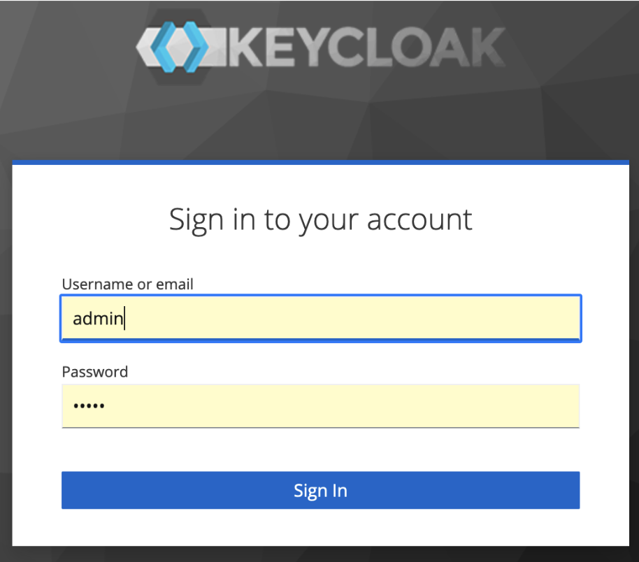

## JBoss Keycloak SSO Solution

#### 1. [Spring Security Project](https://spring.io/projects/spring-security)
Spring Security 프레임워크 기반으로 OAuth2 Authorization Server 및 OAuth2 Client 그리고 OAuth2  Resource Server 구현이 가능하였다. 하지만 2022년 6월, Spring Security Project는 Client 및 Resource Server 지원만 남기고 Authorization Server는 Spring Authorization Server 라는 이름의 단독 프로젝트로 분리 시켰다.

#### 2. [Spring Authorization Server](https://spring.io/projects/spring-authorization-server)
OAuth 2.1 스펙과 OpenID Connect 1.0 (OIDC) 스펙을 완벽히 지원하는 SSO(Single Sign-On) OAuth2 Authorization Server 작성을 가능하게 해주는 프레임워크이다. 



#### 3. Keycloak
1. SSO Soultion
	<p>
	<a href='https://www.keycloak.org'>Keycloak</a>은 JBoss 팀이 개발한 Java 기반의  OAuth 2.1, OIDC 1.0 그리고 SAML를 지원하는 SSO 솔류션이다. 2014년, RedHat이 JBoss를 인수하면서 RH-Keycloak 이라는 이름의 상용 솔류션을 출시했다. 한편, RedHat 내에 WildFly로 이름을 바꾼 JBoss 팀이 지속으로 Keycloak 오픈소스 프로젝트를 진행하고 있으며 현재(2023, 10월) 22.0.5 LTS 버젼까지 출시되어 있다.
	</p>

2. Embeded
	<p>
	자바 기반의 오픈 소스 솔류션이기 때문에 다양한 방식으로 보안 인프라에 운용된다. 완성도가 높은 솔류션이기 때문에 별다른 커스터마이징 또는 부가적인 코딩작업 없이 설치만으로 운용이 가능하며 클라우드 환경의 도커 컨테이너 운용도 많이 선호된다.
	</p>
	<p>
	한편, Spring Cloud 기반 MSA 인프라에서는 Spring Boot에 임베드하는 방식도 많이 선택된다. 자바 기반이라 소스 레벨에서 Spring Boot에 임베드하기가 어렵지 않으며 커스터마이징이 가능하다는 것도 장점이다. 하지만, 무엇보다 Keyclock 자체를 Spring Cloud 기반의 MSA 서비스로 등록하여 고가용성을 확보할 수 있다는 것이 MSA 인프라 환경에서는 더 큰 매력이라 볼 수 있다.
 	</p>

#### 4. Keycloak Embeded
1. 예제 소스: /servers/embedded-springboot-keycloak-server/embedded-keycloak-server
2. 실행 환경
	- Keycloak 18.0.0
	- Java 21
	- Spring Boot 2.7.18
	- MariaDB 10.x
3. 주요 설정(application.yml)
	-	datasource
		
		```yaml
		datasource:
			driver-class-name: org.mariadb.jdbc.Driver
			url: jdbc:mariadb://localhost:3306/keycloak?characterEncoding=utf8
			username: keycloak
			password: keycloak
		```
	
	- server
		
		```yml
		server:
		  forward-headers-strategy: native
		  port: 5555
		  servlet:
		  context-path: "/"
		```
	
	-	keycloak
	
		```yml
		custom:
			server:
				keycloak-path: ""
				adminUser:
					username: admin
					password: admin
					create-admin-user-enabled: true
		```

4. 빌드
	```
	$ mvn clean install
	```

5. 실행
	```sh
	$ java -jar embedded-keycloak-server.jar
	```

6. 접근 (http://localhost:5555)
	
	
	
8. 관리자 로그인

	


