### Flow "A" Impelementation - Authorization Server

#### 1. Keycloak Security Configuration : Keycloak Security Configuration Objects
OAuth2 보안 도메인의 구성요소들과 구성 요소들간의 자원 접근에 대한 권한 인가 그리고 승인등의 개념을 이해했다면 인가서버(Authorization Server, Keycloak)에 클라이언트, 사용자(자원소유자), 권한범위 등을 먼저 등록해야 한다는 것을 눈치챘을 것이다. Keycloak 보안설정에서 이 것들을 우선 등록한다. 등록 작업을 하기 전에 Keycloak 보안 설정 객체(대상)들부터 우선 살펴보고 OAuth2 상세의 주요 요소들과의 매핑 관계도 정리해 본다.
	
 1. Realm

OAuth2 상세에는 없지만 클라이언트, 사용자, 자격증명, 역할 및 그룹집합 등을 관리하는 객체다. Realm들 끼리는 서로 격리되어 있다. 사용자들이 생성하는 데이터가 있고 이를 여러 애플리케이션으로 접근하는 포털이나 SNS 서비스를 예로 든다면 그 포털이나 SNS 서비스 그 자체로 생각해도 된다. 

3. Client

사용자(자원소유자, Resource Owner)는 자원에 대한 권한을 클라이언트에게 인가(Authorization)하고 인가서버(Keycloak)는 그 인가를 승인(Grant)한다. 클라이언트가 인가서버에게 인가승인 요청을 최초로 하게되는데 인가서버는 자신에게 등록된 클라이언트에게만 그 절차를 진행해야 할 것이다. 바로 그 등록할 클라이언트의 정보를 의미한다. Keycloak에서는 Realm에 클라이언트를 아이디(이름)으로 등록하고 등록과 동시에 클라이언트 시크릿(Clinet Secret)을 발급한다. 이 시크릿은 인가승인 과정에서 사용된다.  

3. User

인가서버가 승인해야 할 권한의 대상이 되는 자원의 소유자다. 사용자는 아마 클라이언트를 통해 최초 권한승인 요청을 인가서버로 부터 받거나 할 수도 있다. 사용자 입장에서 쉽게 말로 해보면 "내가 이 클라이언트에게 내 권한을 인가해 줄테니 승인좀 부탁한다" 이 정도의 의미로 인가서버에 자신을 인증(Authentication)한다. 당연히 인가서버에 등록된 사용자만이 이를 할 수 있다. 사용자(User)는 인가서버에게 자격 증명(Credentials)을 제출하고 인증(Authentication)되면 Role로 표현된 권한을 클라이언트에게 인가할 수 있다. 인가서버는 이를 액세스 토큰(Access Token) 발급으로 승인한다.

4. Role

OAuth2 상세에는 권한에 대한 구체적 상세는 없다. 자원소유자가 자신의 자원에 대한 액세스 권한을 클라이언트에게 인가할 때, 그 액세스 수준을 제한할 필요가 있다. 예를들면 읽기만 허용한다던지 읽기, 쓰기 모두 허용한다던지 하는 경우다. 이를 위해 Keyclock에서 Role을 정의하여 클라이언트가 자원에 대해 수행할 수 있는 작업의 범위를 제한 할 수 있게 한다.

	

#### 2. Keycloak Security Configuration : Realm 
1. Ream 생성
	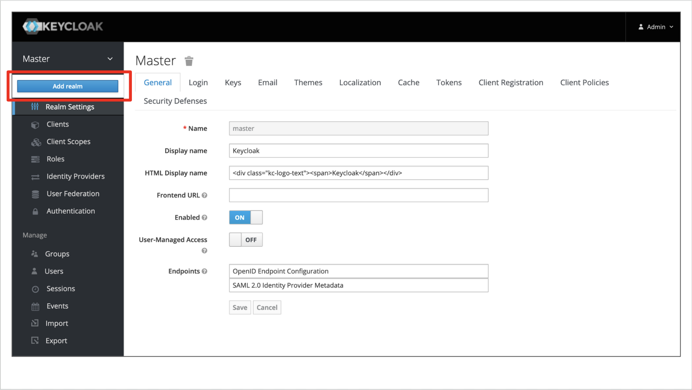
	 
	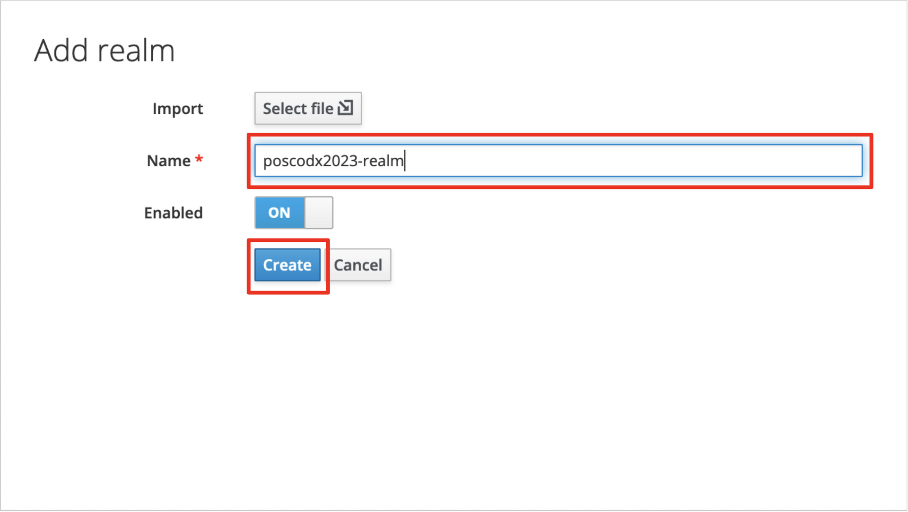

	<pre>
	1) Name 입력
	2) Create 버튼 클릭
	</pre>

	2. Realm 생성 완료
	
	Token 탭에서 Token의 세부사항을 설정 할 수 있다.

#### 3. Keycloak Security Configuration : Client
1. Client 생성
	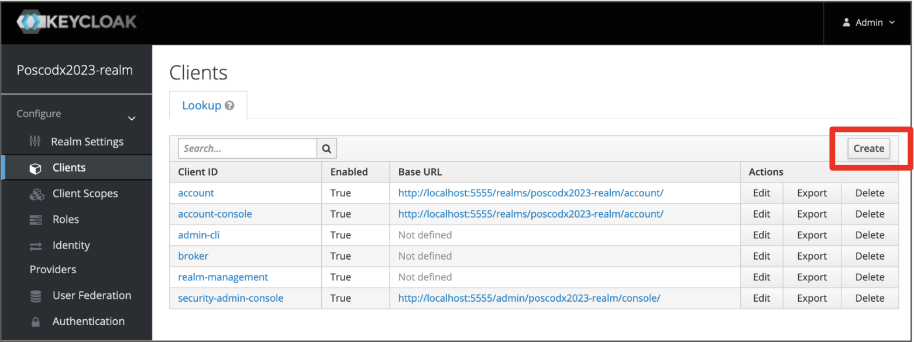

2. Clinet 기본 정보 입력
	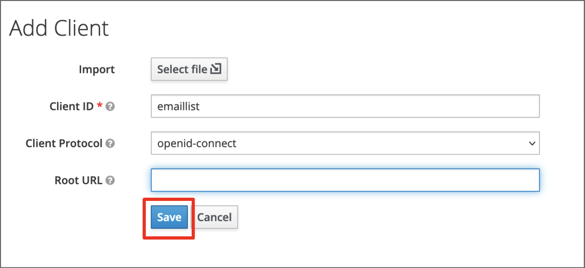
	<pre>
	1) client id를 지정한다.
	2) 프로토콜은 openid-connect 이다.
	3) Root URL은 필요 없다.
	</pre>

3. Client 생성 완료
	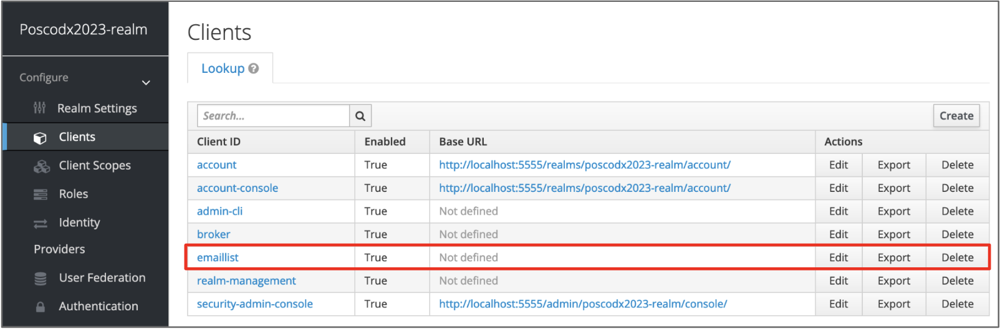
		
4. Clinet 세부 설정
	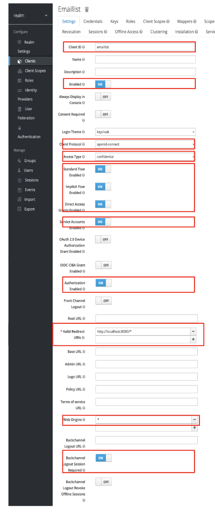	
	<pre>
	 1) Client ID : emaillist
	 2) Enabled : On
	 3) Client Protocol : openid-connect
	 4) Access Type : Confidential
	 5) Standard Flow Enabled : On (Authorization Code Grant)
	 6) Implicit Flow Enabled: On (Implicit Grant)
	 7) Direct Access Grant Enabled : On (Resource Owner Password Credentials Grant)
	 8) Service Account Enabled : On
	 9) Authorization Grant Enabled : On
	10) Valid Redirect URIs: http://localhost:8080/*
	11) Web Origins: *
	12) Backchannel Logout Session Required: On
	</pre>
	
#### 4. Keycloak Security Configuration : Roles
Keyloak에서 Role은 Realm Role과 Client Role 이렇게 두 가지로 구분하여 생성하고 관리할 수 있다. OAuth2는 사용자가 클라이언트에게 권한(Role)을 인가한다 라고 상세하는데 Keycloak 보안 설정에서는 Realm Role 또는 Client Role을 사용자에게 매핑하는 방식으로 이를 구현한다.
	
1. Role 생성
	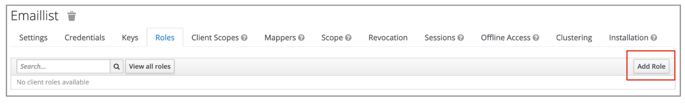
	Add Role 버튼 클릭
	 

	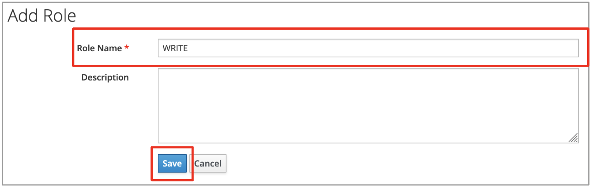
	<pre>
	1) Role Name 등록 (보통 대문자로...)
	2) Save 버튼 클릭
	</pre>

2. 생성 완료
	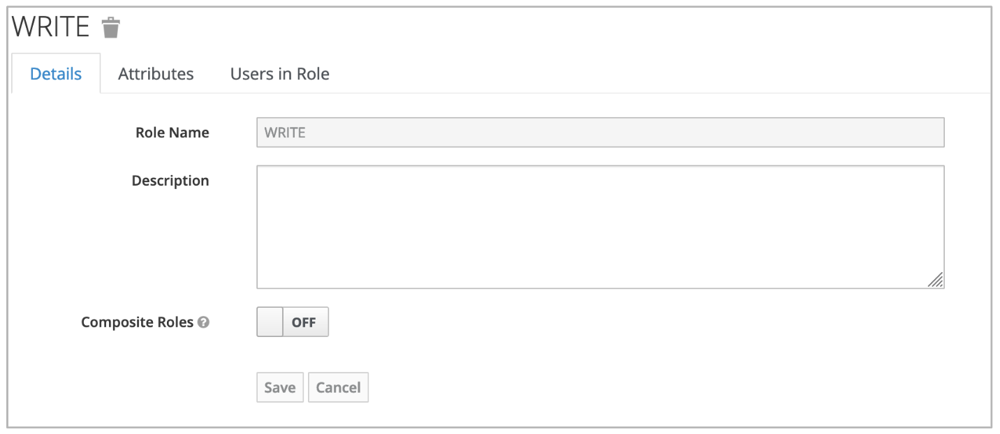
	Composite Roles를 켜면 여러 복수 role를 합성한 Role을 생성 할 수 있다.
	 
	
3. READ Role 생성하기	
	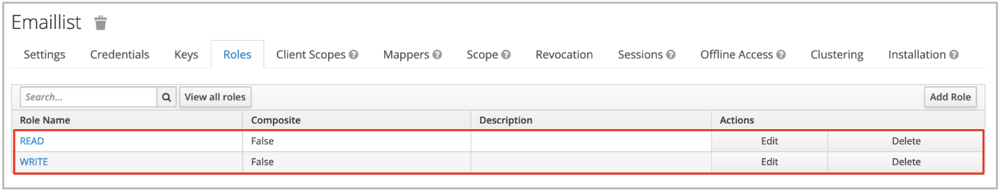

#### 5. Keycloak Security Configuration : Users
1. User 생성
	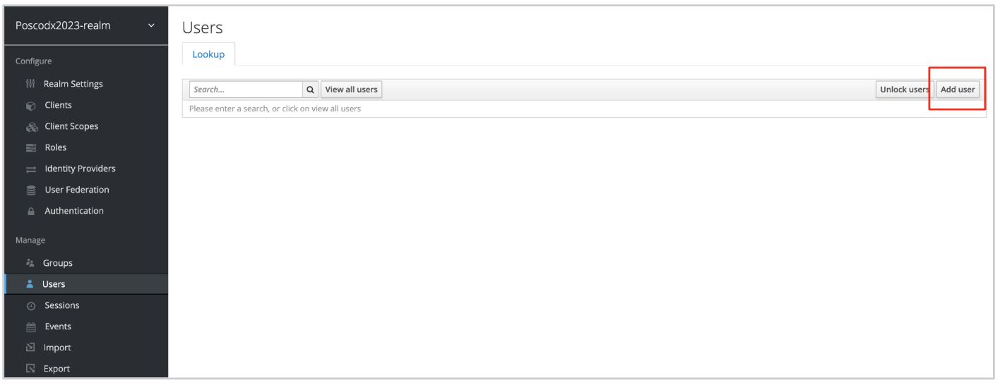
	Add 버튼 클릭
	 

2. 기본 정보 입력
	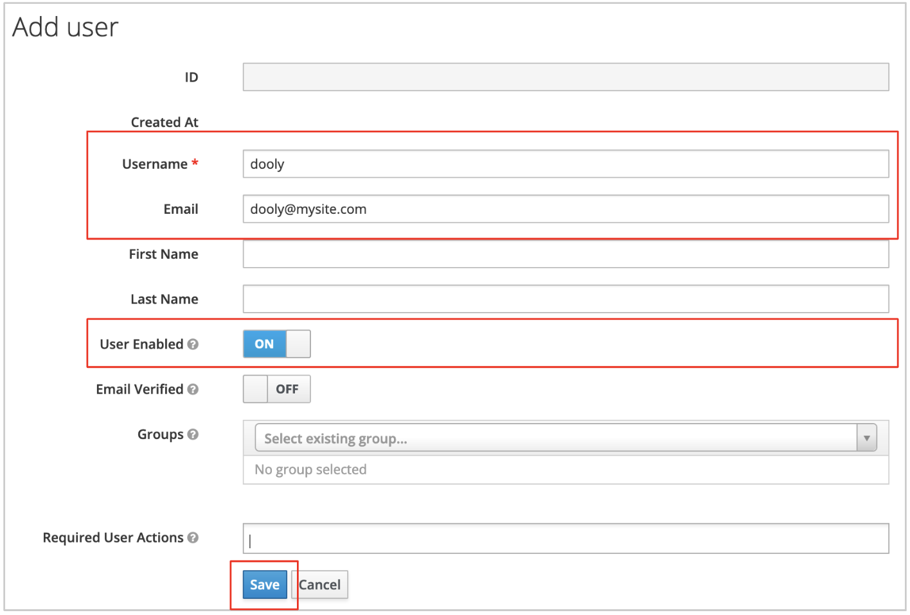
	<pre>
	1) Username: 신원 증명에 반드시 필요하다.
	2) Email: 입력 하면 신원 증명에 email도 사용할 수 있다.
	3) User Enabled: ON
	4) Save 버튼 클릭
	</pre>

3. 생성 완료
	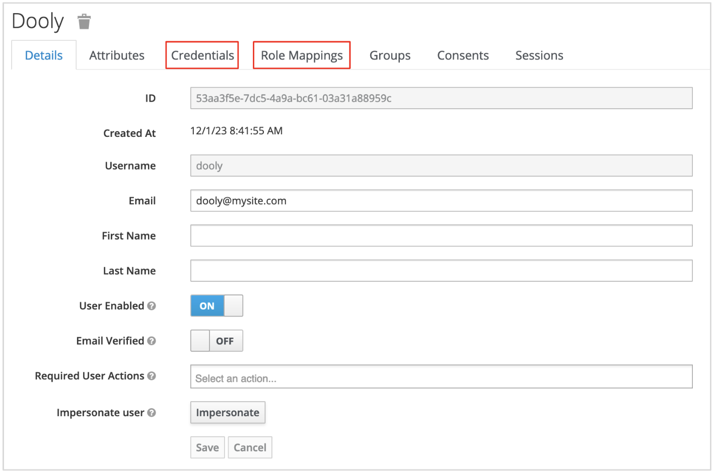
	생성 후, 반드시 해야하는 설정은 Credentials, Role Mapping 이다.
	 

4. Credentials (Password) 설정
	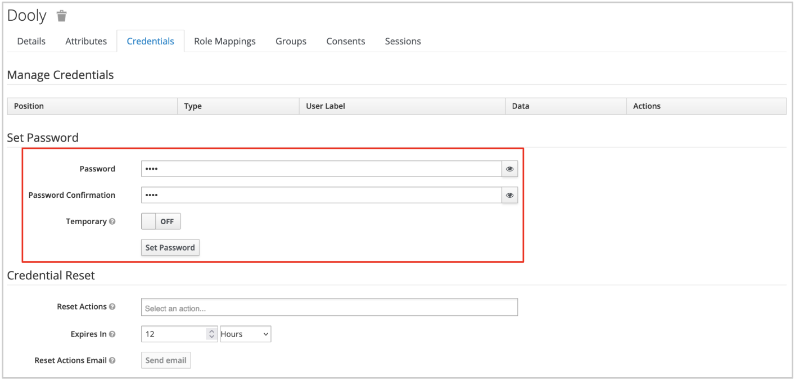
	<pre>
	1) Password : 입력
	2) Temporary: OFF
	3) Set Password 버튼 클릭
	</pre>
	
	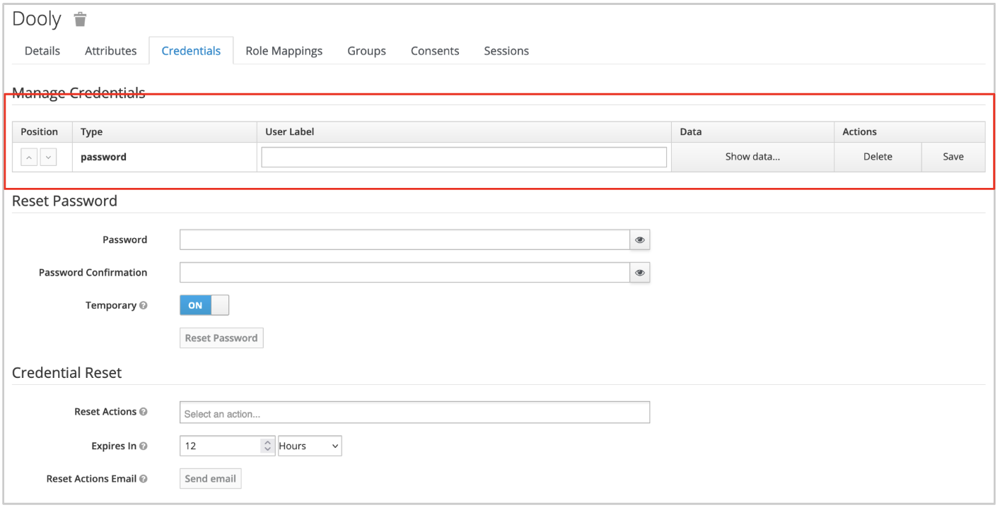
	Password가 설정된 화면
	 
	
5. Role Mapping
	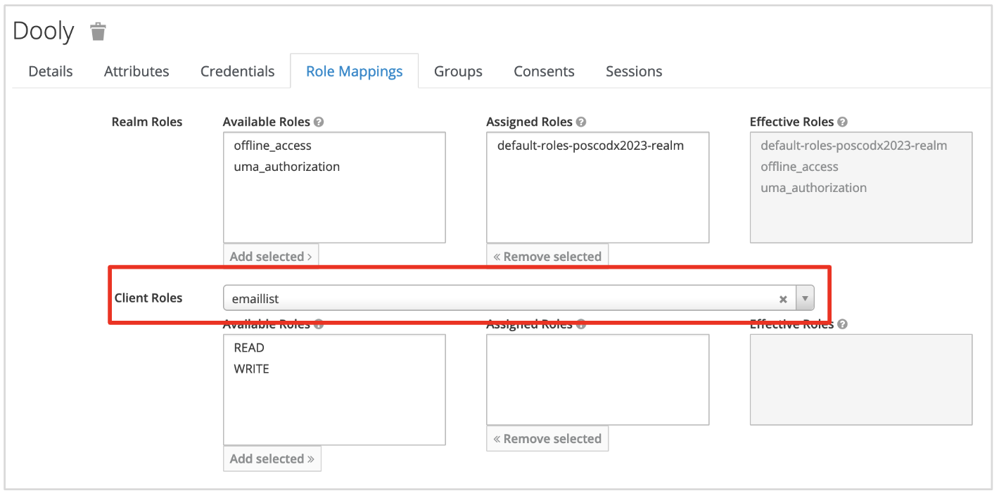
	<pre>
	1) Client Roles 선택
	2) emaillist 클라이언트 선택하면 등록한 emaillist에 생성한 READ, WRITE Role이 보인다.
	</pre>
	
	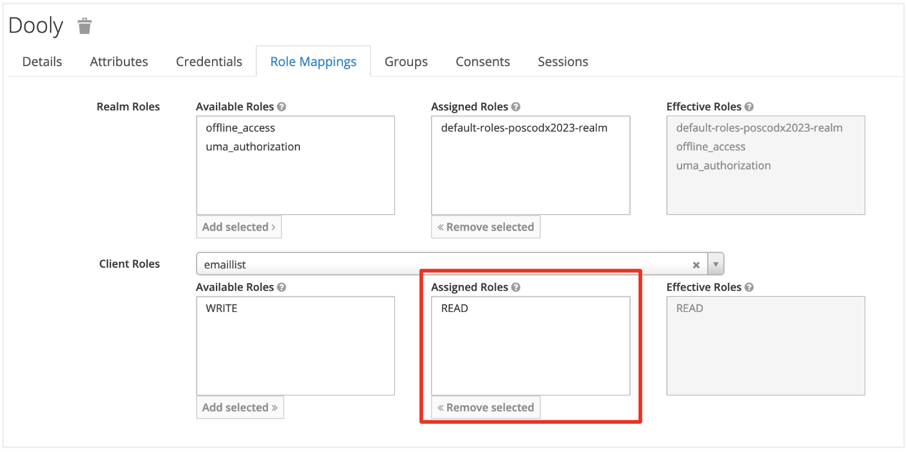
	READ role을 Assigne Role에 추가하여 읽기 권한을 부여 했다.
	 
	
6. Username 'michol' 사용자 생성 및 Roles (READ, WRITE ) 매핑하기
	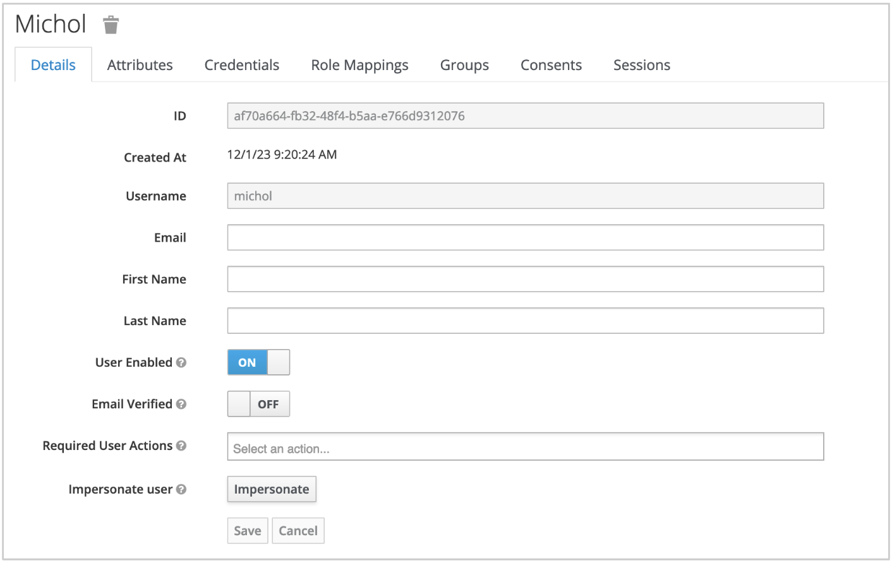
	 
	
	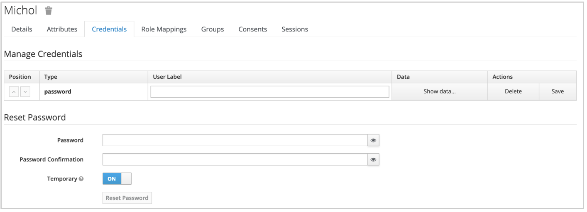
	 
	
	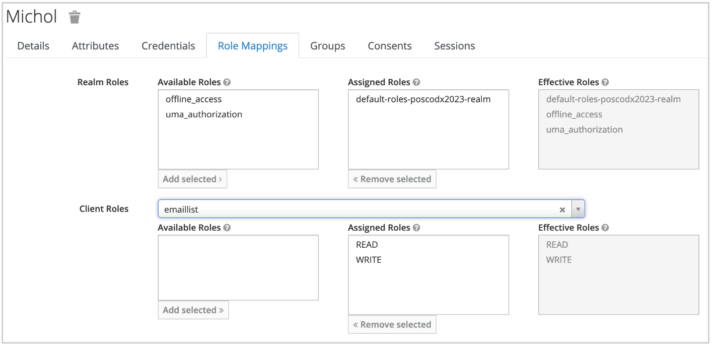
	 
	
#### 6. Keycloak Security Configuration : OpenID Endpoint Configuration
지금 까지의 Keycloack 설정이 인가 서버 설정의 기본이자 대부분이라 생각한다. 따라서 앞으로도 별 다르게 해줄 설정은 거의 없다. 남은 것은 개발을 계획하고 있는 서비스나 소프트웨어의 보안요구에 맞는 Authorization Grant Type을 선택하고 거기에 맞는 클라이언트를 구현하는 것이다.

지금 까지의 설정을 테스트하기 전에 Keycloak의 Realm Settings으로 가서 다음 링크에서 poscodx2023-realm의 가용한 엔드포인트들을 먼저 확인해 보자.

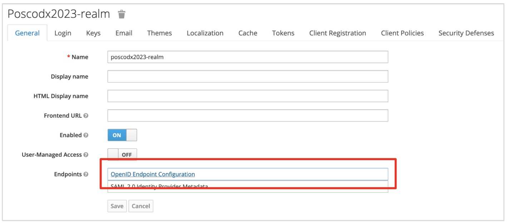
OpenID Endpoint Configuration 링크 클릭
	
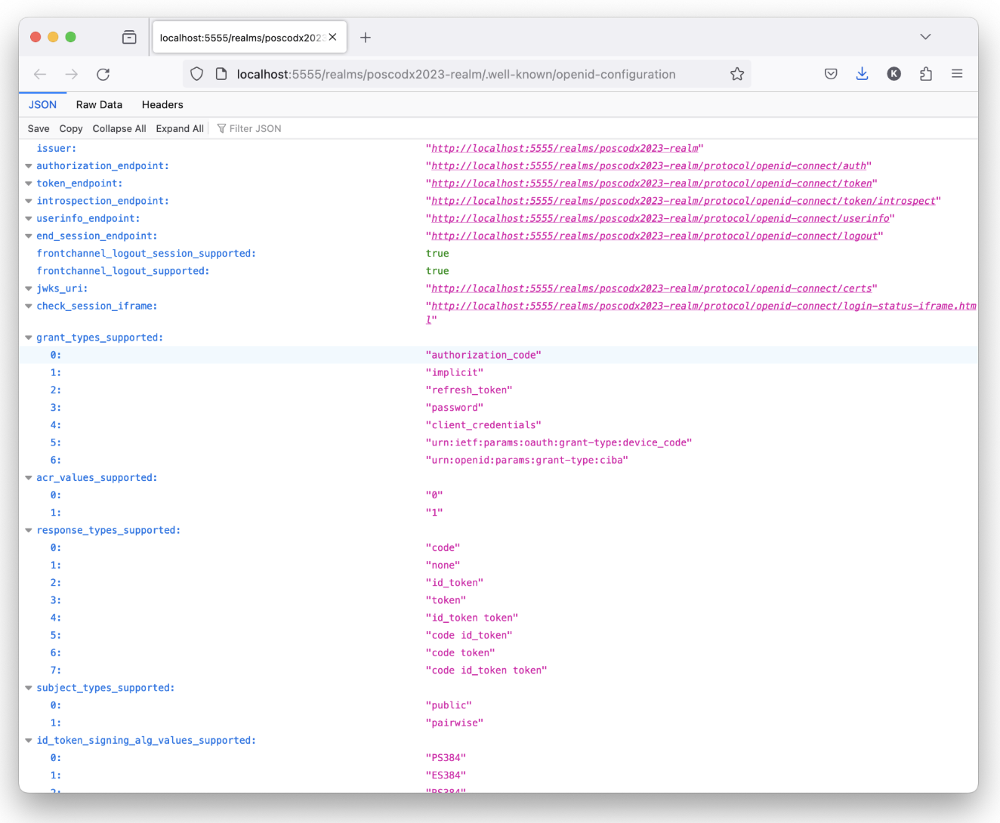
