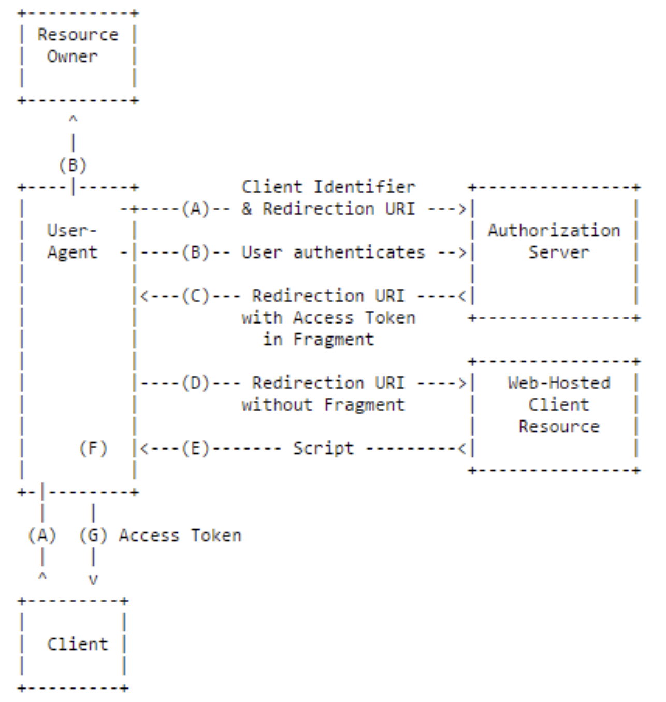

## 3. Implicit Grant

### Flow Diagram

	- Grant Type: none
	- Response Type: token
	- 자격증명을 안전하게 저장하기 힘든 클라이언트에게 최적화된 방식
	- 암시적 승인 방식에서는 권한 부여 승인 코드 없이 바로 Access Token이 발급
	- Access Token이 바로 전달되므로 만료기간을 짧게 설정하여 누출의 위험을 줄인다.
	- Refresh Token 사용이 불가능한 방식
	- Access Token을 획득하기 위한 절차가 간소화
	- Access Token이 URL로 전달된다는 단점
