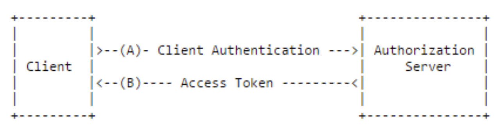

## 5. Client Credentials

### Flow Diagram

	- Grant Type: client_credentials
	- Response Type: none
	- 클라이언트의 자격 증명만으로 Access Token을 획득하는 방식
	- 클라이언트 자신이 관리하는 리소스에만 접근 가능
	- 자격 증명을 안전하게 보관할 수 있는 클라이언트에서만 사용
	- Refresh Token은 사용할 수 없다.
