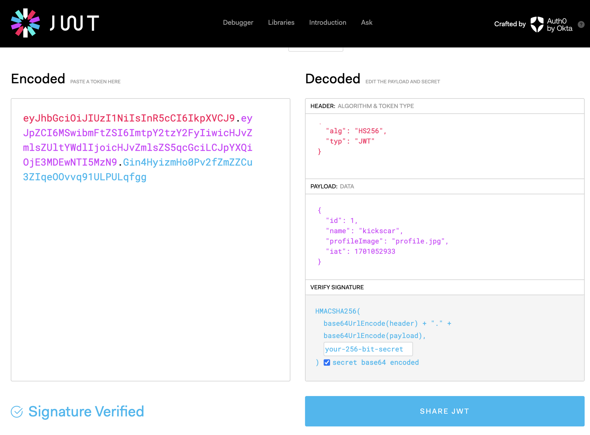

##  JWT Basics


(2), (4) 참고

#### 1. Structure
<pre>
+-----------+   +-----------+   +-----------+
|   Header  |   | Playload  |   | Signature |
+-----------+ . +-----------+ . +-----------+
</pre>
	
#### 2. 3 Parts
1. Header
	1) alg: 암호화 알고리즘(RS256, ES256, HMAC, HS256)
	2) type: 토큰 타입, JWT
	3) Base64url 인코딩(URL-Safe)
2. Playload
	1) data
	2) 각각의 정보의 조각(key: value)를 클레임(claim)이라 한다.
	3) Base64url 인코딩(URL-Safe)
3. Signature
	1) 서명
	2) (header + ''." + payload) + secret 으로 지정한 암호알고리즘으로 암호화(서명) 한다.
    3) token = header + "." + payload + "." + encrypt(header, playload, secret)
    4) JSON Web Signature (JWS) : JSON 서명 표준, RFC7515
    5) JSON Web Encryption (JWE): JSON 암호화 표준, RFC7516
    
#### 3. 실습 예제: /security/jwt-practices/ex01
1. 설치 패키지

	```sh
	# npm i jsonwebtoken dotenv
	```

2. .env
	
	```
	ACCESS_TOKEN_SECRET=d7d34917fbd11fdd89357d ...
	REFRESH_TOKEN_SECRET=3a13ce20d9e44269e1a01 ...
	
	# only for testing
	ACCESS_TOKEN_SECRET_OLD=d7d34917fbd11fdd8 ...
	```

3. sign & verify
	- /oauth2-practices/jwt/ex01/01.js
		
4.	JsonWebTokenError: invalid token
	- /oauth2-practices/jwt/ex01/02.js
	
5.	JsonWebTokenError: invalid signature
	- /oauth2-practices/jwt/ex01/03.js
		
6.	TokenExpiredError: jwt expired
	- /oauth2-practices/jwt/ex01/04.js

#### 4. https://jwt.io 에서 decode 하기


