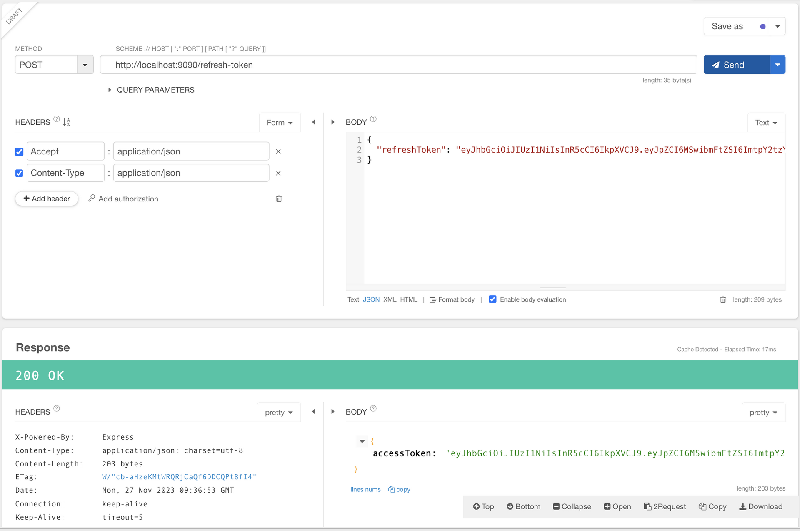

## 2. JWT Simple Server


(3) 참고

#### 1. WorkFlow


#### 2. 간단 구현 서버: /oauth2-practices/jwt/ex02 
1. 설치 패키지

	```sh
	$ npm i express jsonwebtoken dotenv
	```

2. .env
	
	```
	ACCESS_TOKEN_SECRET=d7d34917fbd11fdd89357d ...
	REFRESH_TOKEN_SECRET=3a13ce20d9e44269e1a01 ...
	```

3. package json script
	
	```json
	"scripts": {
		"start": "node basic-jwt-server"
	}
	```

4. 서버 시작

```sh
$ npm start
```


#### 3. 테스트
1. /auth


2. /profile


3. access token expired


4. /refresh-token

