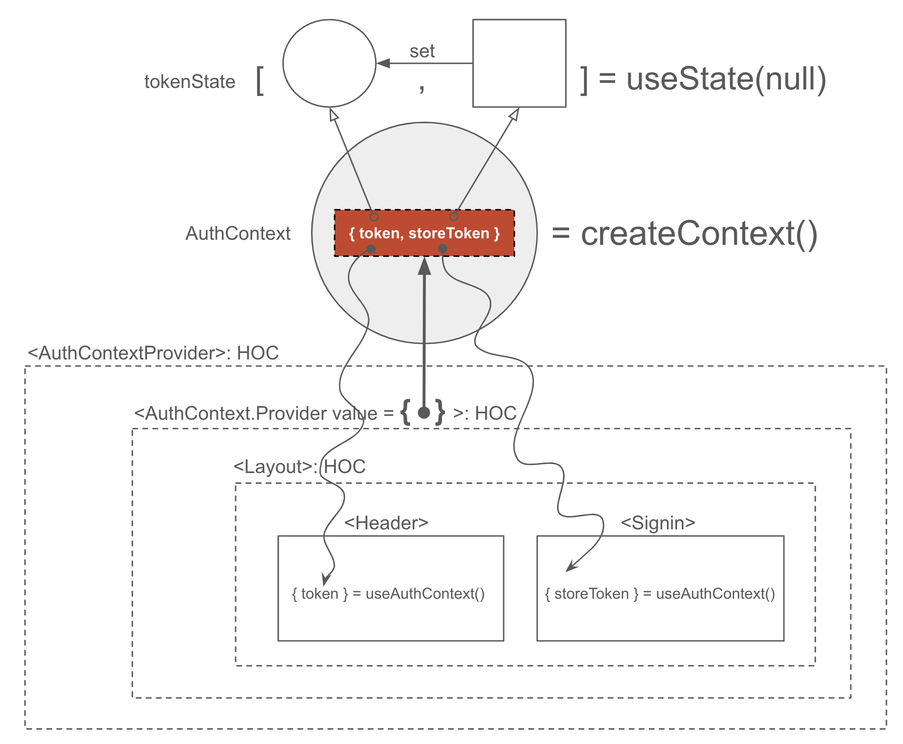

## 3. Storing JWT

#### Storing JWT Locally
1. JWT Client는 access token과 refresh token을 함께 저장한다.
2. access token은 client application의 메모리(react's state)에 저장한다. 
3. access token은 휘발된다. 즉, 새로고침 또는 브라우저를 닫으면 사라진다.
4. access token이 휘발되면 refresh token으로 access token을 재발급 받도록 한다.
5. 단, refresh token이 휘발되지 않도록 하기 위해 cookie에 저장하되 httpOnly 옵션으로 구워 js가 접근하지 못하게 한다.
6. js가 httpOnly cookie의 refresh token에 접근하지 못하지만 서버로 전달되는 http 헤더를 통해 refresh token이 탈취될 가능성이 있기 때문에 ssl(https)로 모든 http 스택을 암호화 하고 cookie 플래그에 secure=true 추가하여 https 상에서만 cookie가 전달되도록 한다.

#### React Context
1. client application의 메모리에 저장된 access token의 payload에는 보통, 애플리케이션에서 필요한 기본적인 사용자 정보(no, username, email, profile image url, ... )를 담는다.

2. component tree 최상위 component가 access token을 발급받고 이를 사용자 정보가 필요한 하위 component들에 전달한도록 한다. 이를 조금 쉽게 하기 위해 react context를 사용

3. 예제
	1) &lt;AuthContextProvider&gt; 작성
	2)  /oauth2-practices/jwt/ex03

4. 설치 패키지

	```sh
	$ npm i -D webpack webpack-cli webpack-dev-server style-loader css-loader node-sass sass-loader babel-loader @babel/core @babel/cli @babel/preset-env @babel/preset-react @babel/plugin-transform-runtime @babel/plugin-syntax-throw-expressions	
	$ npm i react react-dom
	```

5. configuration
	1) webpack: config/webpack.config.js
	2) babel: config/babel.config.json

6. 실행
	```sh
	$ npm run dev
	```

7. 작동원리


